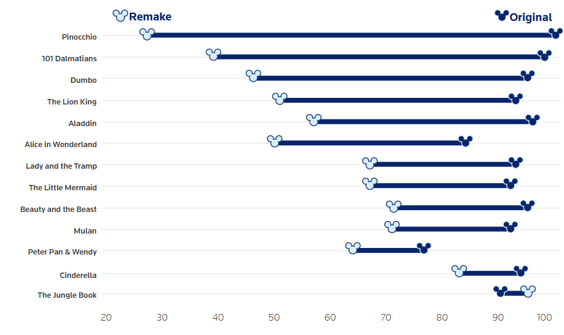
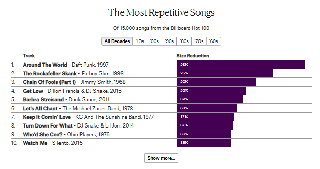
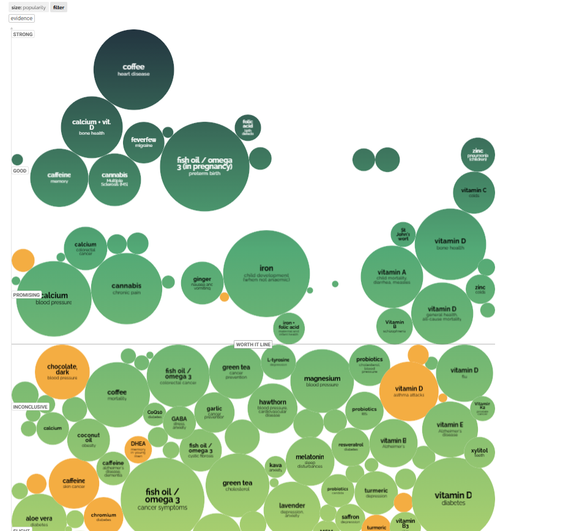

# La evolución del cine de ciencia ficción (1950–2020)

## 🎯 Objetivo
Analizar visualmente cómo ha cambiado el cine de ciencia ficción entre 1950 y 2020, explorando tendencias de producción, duración, recepción crítica y países de origen.

---

## 📊 Visualizaciones incluidas

1. **Línea de tiempo**: Muestra la evolución del número de películas de ciencia ficción producidas por década, permitiendo identificar tendencias de crecimiento o estancamiento.
2. **Dot plot comparativo**: Compara la cantidad total de películas de ciencia ficción y la cantidad de películas premiadas por década, mostrando la brecha entre producción y reconocimiento.
3. **Top 10 películas mejor puntuadas por década**: Ranking interactivo con filtro de década y enlaces directos a IMDb.
4. **Bubble chart de duración y puntaje**: Visualización de las mejores películas por década, con filtro de década, eje vertical de duración, tamaño de burbuja según puntaje y acceso a IMDb.
5. **Barras horizontales por país**: Muestra la cantidad de películas relevantes por país, usando banderas emoji.

---

## 📁 Fuentes de datos
- Datos simulados basados en tendencias reales: [IMDb Advanced Search](https://www.imdb.com/search/title/?genres=sci-fi&title_type=feature&sort=year,asc)

---

## 🖼️ Referencias visuales

### 1. Reuters – Snow White Reimagined
- Enlace: https://www.reuters.com/graphics/WALTDISNEY-FILM/SNOW-WHITE/gkvljloxavb/
- Autor: Reuters Graphics Team
- Descripción: Esta visualización compara la versión animada original de "Blanca Nieves" con la nueva adaptación live-action de Disney. Mediante un scroll narrativo, el usuario observa cómo han evolucionado los personajes, el vestuario y el diseño visual de las escenas.
- **Aspectos positivos:**
  - Uso eficaz del scroll narrativo para guiar al usuario a través de una historia visual.
  - Comparaciones visuales claras, con imágenes de antes y después lado a lado.
  - Diseño limpio y profesional, compatible con múltiples dispositivos.
- **Aspectos negativos:**
  - Requiere conexión estable para cargar imágenes de alta resolución.
  - Limitada interacción directa del usuario más allá del scroll.
  - No es adecuada para usuarios que buscan explorar libremente los datos o filtrar información.

Se tomo de referencia este gráfico
### 2. The Pudding – Are Pop Lyrics Getting More Repetitive?
- Enlace: https://pudding.cool/2017/05/song-repetition/
- Autor: Colin Morris (The Pudding)
- Descripción: Analiza si las letras de canciones populares se han vuelto más repetitivas con el tiempo. Utiliza animaciones controladas por scroll para visualizar la estructura lírica de miles de canciones, combinando narrativa textual con gráficos dinámicos.
- **Aspectos positivos:**
  - Alta interactividad basada en scroll, lo que genera una experiencia inmersiva.
  - Excelente integración entre datos, visualización y narrativa.
  - El diseño modular permite entender fácilmente cada sección.
- **Aspectos negativos:**
  - Requiere experiencia avanzada para replicar efectos de scroll dinámico.
  - Puede ser menos accesible en móviles o equipos lentos.
  - Algunos usuarios pueden perderse si no hay buena guía visual.

Se tomo de referencia este gráfico
### 3. Information is Beautiful – Snake Oil Supplements?
- Enlace: https://informationisbeautiful.net/visualizations/snake-oil-supplements/
- Autor: David McCandless
- Descripción: Representa visualmente qué suplementos alimenticios tienen respaldo científico y para qué enfermedades o condiciones. Cada punto en el gráfico se posiciona según la evidencia de efectividad, con filtros interactivos para explorar distintas categorías.
- **Aspectos positivos:**
  - Visual jerárquico y ordenado, fácil de explorar.
  - Uso claro del color y la tipografía para comunicar niveles de evidencia.
  - Permite filtrar por categoría o condición de salud.
- **Aspectos negativos:**
  - No tiene scroll narrativo ni transiciones animadas.
  - Interacción limitada a filtros básicos, sin narrativa guiada.
  - El diseño puede saturarse si no se adapta bien a otros temas.

Se tomo de referencia este gráfico

---

## 👨‍💻 Autor
Brayan Cuyate – Curso: Desarrollo Web y Diseño Visual de Información

---

## 📈 Conclusiones
El análisis de la evolución del cine de ciencia ficción entre 1950 y 2020 revela tendencias clave:

- **Producción:** La cantidad de películas de ciencia ficción ha crecido de forma sostenida, con un salto notable desde los años 80 y un pico en la década de 2010, reflejando el auge del género y el avance tecnológico.
- **Reconocimiento:** Aunque la producción ha aumentado, solo una fracción de las películas recibe premios, pero la proporción de premiadas también crece en décadas recientes, mostrando mayor reconocimiento crítico.
- **Narrativa y calidad:** Las películas han incrementado su duración y mejorado su recepción crítica, lo que sugiere una mayor ambición narrativa y aceptación del género.
- **Top 10 y clásicos:** Cada década aporta clásicos destacados, pero a partir de los años 70 y 80 las películas logran puntajes críticos más altos y mayor presencia en la cultura popular, como se observa en el ranking interactivo.
- **Duración y puntaje:** Las películas mejor valoradas presentan duraciones variadas, aunque muchas de las más extensas también logran altos puntajes, lo que sugiere que la ambición narrativa y la profundidad temática pueden estar asociadas a una mejor recepción crítica.
- **Diversidad temática:** Los subgéneros más populares son los viajes espaciales y los alienígenas, pero la distopía y la inteligencia artificial han ganado terreno, reflejando nuevas inquietudes sociales y tecnológicas.
- **Globalización:** Estados Unidos lidera la producción, pero países como Reino Unido, Japón y Francia han aportado obras influyentes, evidenciando la internacionalización del género.
- **Valor de la exploración interactiva:** El uso de filtros, rankings y visualizaciones dinámicas permite al usuario descubrir patrones, comparar décadas y profundizar en títulos específicos, enriqueciendo la comprensión del fenómeno.

En conjunto, el cine de ciencia ficción ha pasado de ser un nicho a convertirse en un fenómeno global, diverso y cada vez más valorado tanto por el público como por la crítica. El análisis visual e interactivo revela no solo el crecimiento cuantitativo, sino también la evolución cualitativa y cultural del género a lo largo de siete décadas. 